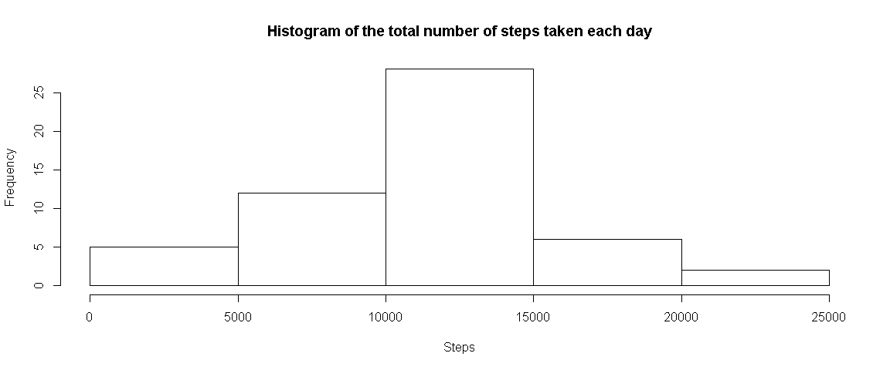
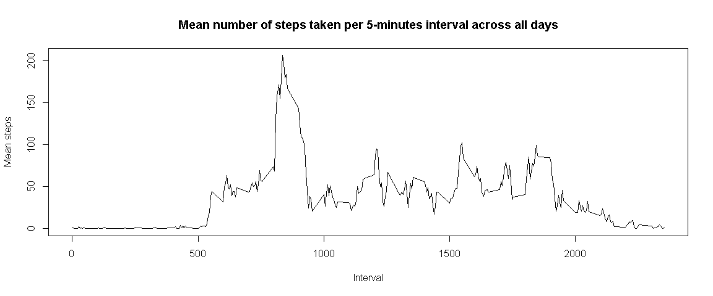
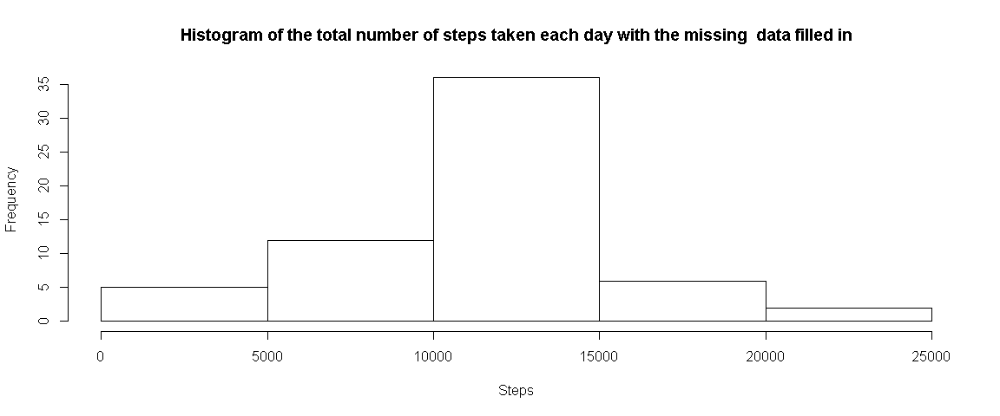
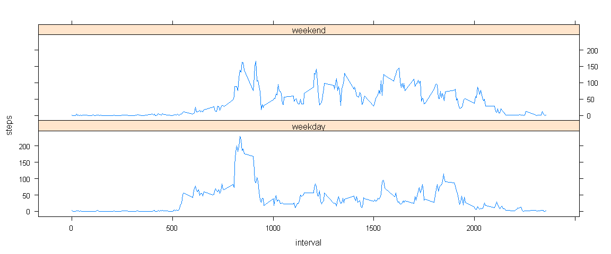

# Reproducible Research: Peer Assessment 1
Friday, October 17, 2014  

## Loading and preprocessing the data


**1. Loading activity.csv**

```r
activities=read.csv(file)
```

**2. Process/transform the data into a format suitable for our analysis.**


```r
activitiesR=na.omit(activities)
```

## What is mean total number of steps taken per day?

For this part of the assignment, we ignore the missing values in the dataset.

**1. We make a histogram of the total number of steps taken each day.**


```r
library(lattice)
sumStepsPerDay<-aggregate(steps~date,activitiesR,sum,na.rm=TRUE)
hist(sumStepsPerDay$steps, xlab="Steps", main="Histogram of the total number of steps taken each day")
```

 

**2. We calculate and report the mean and median total number of steps taken per day.**


```r
meanSteps <- mean(sumStepsPerDay$steps)
medianSteps <- median(sumStepsPerDay$steps)
```

- Mean: **10766.1886792** steps per day
- Median: **10765** steps per day

## What is the average daily activity pattern?

**1. We make a time series plot (i.e. type = "l") of the 5-minute interval (x-axis) and the average number of steps taken, averaged across all days (y-axis).**


```r
meanStepsPerInterval <- aggregate(steps ~ interval, activitiesR, mean)
names(meanStepsPerInterval)<-c("interval","MeanSteps")
plot(meanStepsPerInterval, type="l", xlab="Interval", ylab="Mean steps", main="Mean number of steps taken per 5-minutes interval across all days")
```

 

**2. Which 5-minute interval, on average across all the days in the dataset, contains the maximum number of steps?**


```r
i <- which.max(meanStepsPerInterval$MeanSteps)
interval <- meanStepsPerInterval$interval[i]
```

The interval that contains the maximum number of steps on averable is **835**. 

## Imputing missing values

It is important to note that there are a number of days/intervals where there are missing values (coded as NA). The presence of missing days may introduce bias into some calculations or summaries of the data.

**1. We calculate and report the total number of missing values in the dataset (i.e. the total number of rows with NAs).**


```r
narow <- nrow(activities[is.na(activities),])
```

The total number of row with NAs is **2304**. 

**2. We then devise a strategy for filling in all of the missing values in the dataset.**

In this case, we used the mean for the 5-minutes intervals.

**3. We then create a new dataset that is equal to the original dataset but with the missing data filled in.**


```r
library(plyr)
simulated <- join(activities, meanStepsPerInterval, by="interval")
simulated$steps[is.na(simulated$steps)] <- simulated$MeanSteps[is.na(simulated$steps)]
simulated <- simulated[,!(names(simulated) %in% c("MeanSteps"))]
```


**4. Finally, we make a histogram of the total number of steps taken each day and calculate and report the mean and median total number of steps taken per day.**


```r
sumStepsPerDaySimulated<-aggregate(steps~date,simulated,sum)
hist(sumStepsPerDaySimulated$steps, xlab="Steps", main="Histogram of the total number of steps taken each day with the missing  data filled in")
```

 

```r
meanStepsSimulated <- mean(sumStepsPerDaySimulated$steps)
medianStepsSimulated <- median(sumStepsPerDaySimulated$steps) 
```

The mean values did not change and the median did not changed significantly because we used the average on the 5-minutes interval.

- Mean: **10766.1886792** steps per day
- Mean (simulated): **10766.1886792** steps per day

- Median: **10765** steps per day
- Median (simulated): **10766.1886792** steps per day

## Are there differences in activity patterns between weekdays and weekends?

For this part, we use the dataset with the filled-in missing values.

**1. We create a new factor variable named *daytype* in the dataset with two levels - "weekday" and "weekend" indicating whether a given date is a weekday or weekend day.**


```r
#0 is Sunday and 6 is Saturday 
simulated$daytype <- sapply(as.POSIXlt(simulated$date)$wday, function(x){if(x==6 || x==0) "weekend" else "weekday"})
```

**2. We make two panel plots containing a time series plot (i.e. type = "l") of the 5-minute interval (x-axis) and the average number of steps taken, averaged across all weekday days and another for weekend days (y-axis).**


```r
meanStepsPerInterval <- aggregate(steps ~ interval+ daytype, simulated, mean)
xyplot(steps ~ interval | daytype, data = meanStepsPerInterval, layout = c(1, 2), type="l")
```

 
